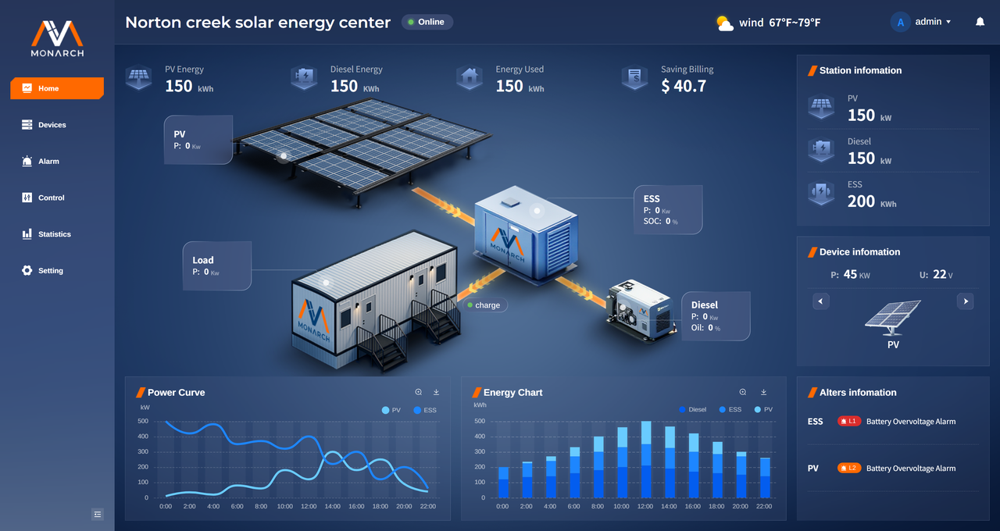

# 平台介绍

 **monarch cloud**平台是一套面向边缘能源站点的综合监控与分析平台，旨在为用户提供清晰、统一、可视化的站点运行视图。平台覆盖发电、储能、用能及告警等关键业务场景，通过标准化的界面与一致的交互方式，帮助用户快速掌握设备状态、运行趋势与异常情况，提升日常运维效率与管理质量。
  平台主要能力包括：

- **站点总览**：集中展示能量概况、能量流向、功率/能量趋势及站点与设备摘要，便于快速判断运行健康度。
- **设备监控**：按设备类型（光伏、储能、电表、柴油机等）提供概览与值监控页面，支持实时数据与状态查看。
- **告警管理**：区分当前告警与历史告警，支持查询、筛选与导出，便于异常定位与追溯。
- **运行统计**：提供统计概览、曲线分析与运行/操作日志，支持运行数据复盘与趋势分析。
- **统一体验**：表格筛选、分页、更新时间提示等交互一致，降低学习成本。
**本手册面向普通用户。**
