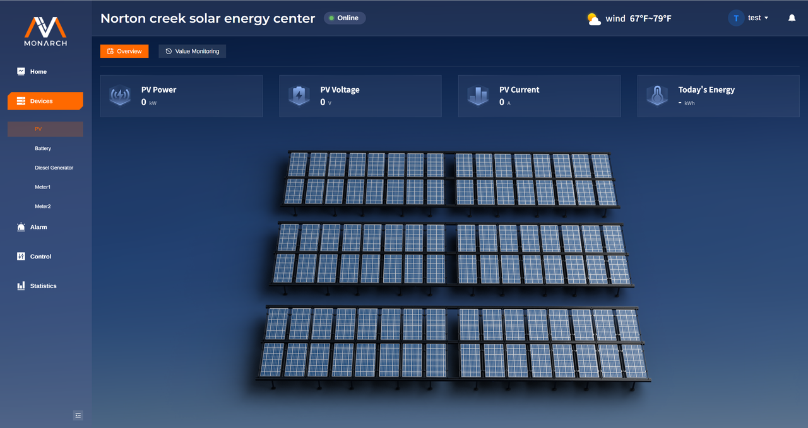

# Devices 页面

**Devices** 包含多个设备类型，包括：**PV**、**Battery**、**Diesel Generator**、**Meter1**、**Meter2**。
每个设备的页面中通常有：

-  **Overview（概览）**：设备关键指标卡片/概览展示
- **Value Monitoring（值监控）**：实时点位的表格展示，展示的是与真实设备绑定的通道中Telemetry、Signal的相关数据。
