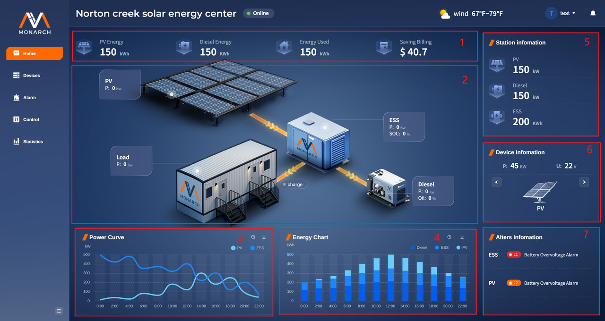
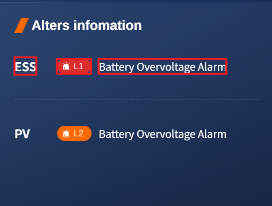

# Home 页面

**Home**页面主要展示站点以及具体设备的关键数据，并且随着设备状态实时进行数据刷新。

- 第一部分为站点的能量概览卡片，主要有对 **PV Energy**、**Diesel Energy**、**Energy Used**、**Saving Billing**的统计数据。
- 第二部分为微电网系统的拓扑图，其展示了能量的流动方向（设备充放电情况），同时展示了各个设备的核心数据：
  - **PV**：`P`（当前功率）
  - **Load**：`P`（当前功率）
  - **ESS**：`P`（当前功率）、`SOC`（电池荷电状态）
  - **Diesel**：`P`（当前功率）、`Oil`（当前柴发油量百分比含量）
- 第三部分为功率统计曲线，针对**PV**、**ESS**的功率进行统计。
- 第四部分为能量柱状图，针对**Diesel**、**ESS**、**PV**的能量情况进行统计。
- 第五部分为当前站点信息统计，对**PV**、**Diesel**的当前的功率进行统计，对ESS的充/放电情况进行统计。
- 第六部分为站点设备信息统计，分布对**PV**、**ESS**、**Diesel Generator**的**P（当前功率）**、**U(当前电压)**进行统计。用户可以通过点击左右的切换按钮进行设备的切换。

- 第七部分为站点告警信息，展示当前的告警信息，从左向右依次为：
  - 告警设备
  - 告警等级（按照紧急度排序为：**L1>L2>L3**）
  ||||
  - 告警信息
