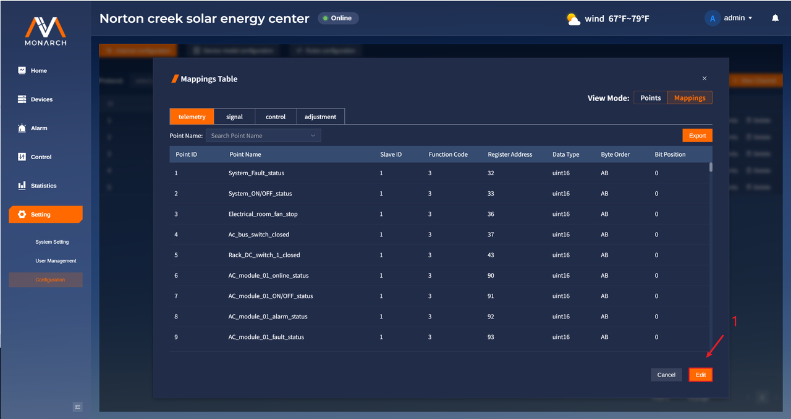
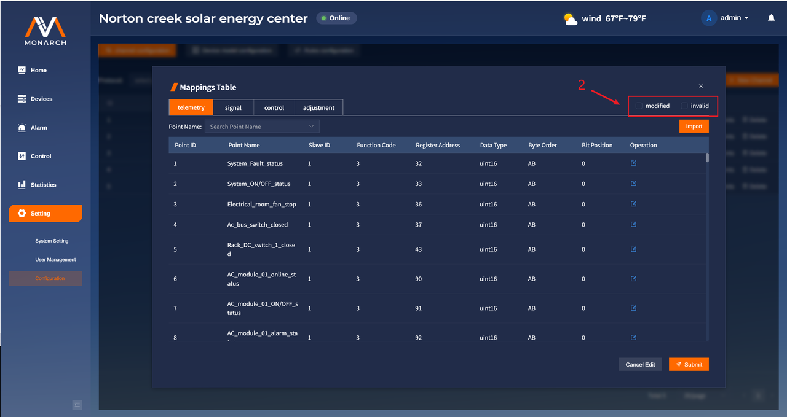
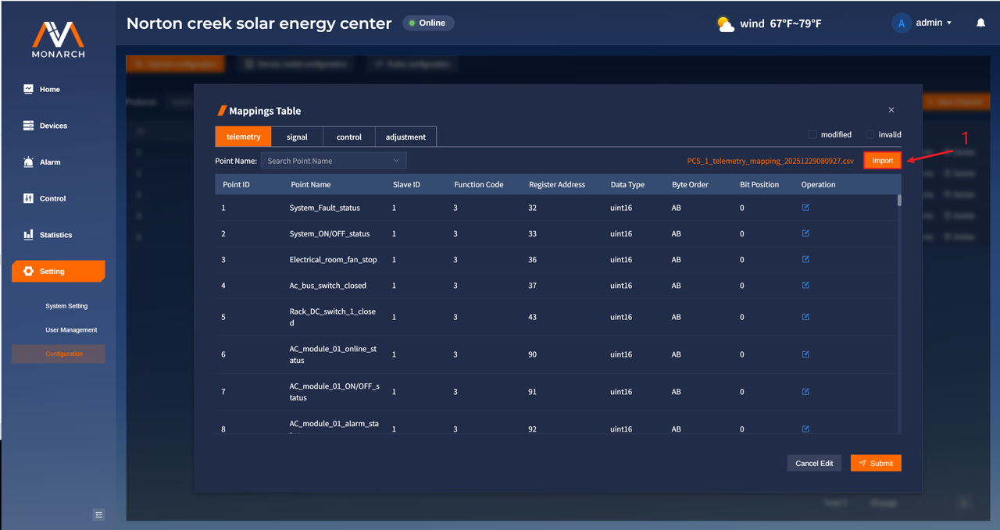
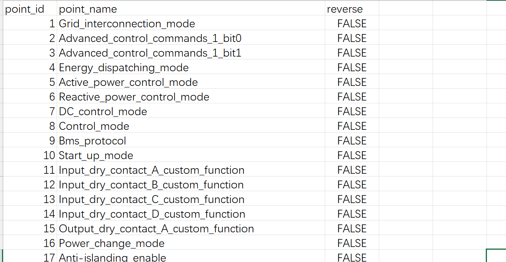
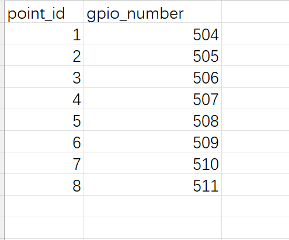
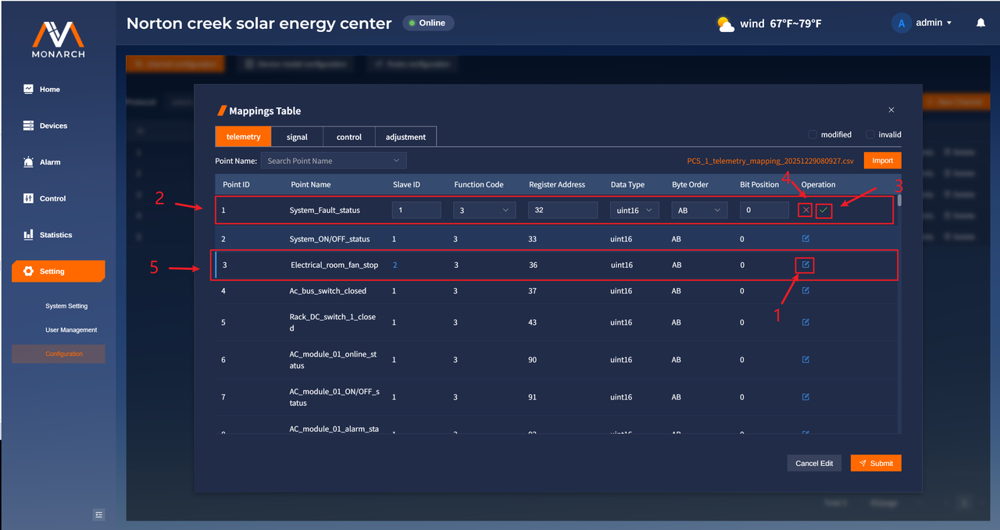
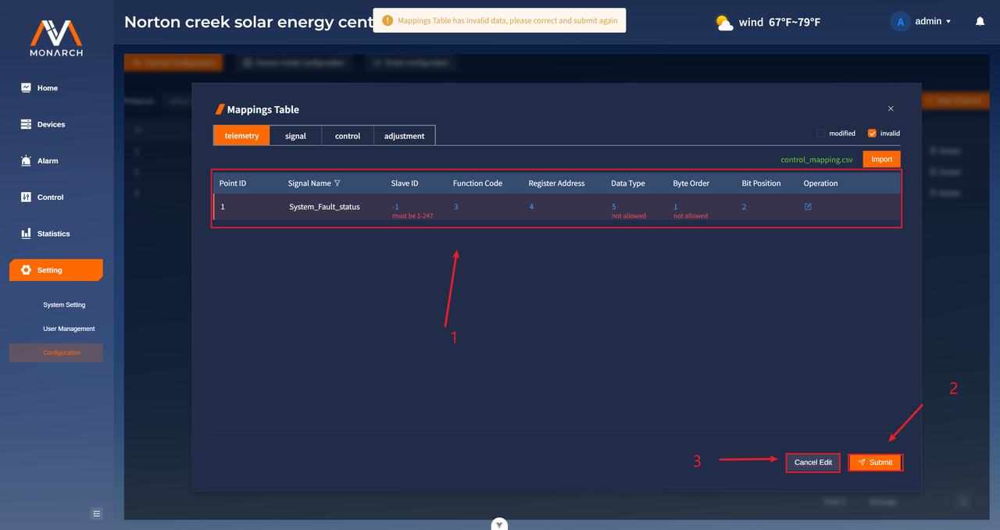

# 通道点位映射配置

## 批量修改点位的映射

1. 在**mappings**视图中，点击**Edit**按钮，进入到点位映射的修改中。

1. 针对修改过程中的修改操作，可以通过筛选条件进行筛选：

- **modified**：对进行了实际修改的点位进行筛选，修改后的点位记录左侧显示为蓝色，修改后的数据标为蓝色。

- **invalid**：对通过增加、修改后存在问题的点位进行筛选，存在问题的点位记录的左侧显示为橙色，背景显示为暗红色。

点位映射配置规则（不同的通道类型其点位的映射信息不同）：

**modbus_rtu/modbus_tcp:**

- **Function Code**取决于当前的点位类型（四遥）：
  - **telemetry**：3、4
  - **signal**：1、2、3、4
  - **control**：5、15、6、16
  - **adjustment**：6、16
- **Data Type**：
  - **telemetry**：int16、uint16、int32、float32、uint32、int64、uint64、float64
  - **signal**：同 telemetry，此外允许 bool
  - **control**：同 telemetry，此外允许 bool
  - **adjustment**：同 telemetry
- **Byte Order**的可选项由数据长度决定：
  - **bool**：无限制
  - **16 位**：AB、BA
  - **32 位**：AB、BA、ABCD、DCBA、BADC、CDAB
  - **64 位**：在 32 位基础上增加 ABCDEFGH、HGFEDCBA、BADCFEHG、GHEFCDAB
- **Bit Position**：**仅在“dataType为bool并且functionCode为3/4”或“16 位”整数类型下可编辑（0-15），其他类型固定为 0。**

### 通过文件导入点位映射信息

1. 点击**Import**按钮，选择csv格式的点位文件进行导入，根据不同的通道类型，对文件格式内容有不同的要求要求：

* **modbus_rtu/modbus_tcp**

  - 期望表头：

    `point_id,slave_id,function_code,register_address,data_type,byte_order,bit_position`

  - 字段说明：遵循点位配置规则要求。

  - 格式截图：

    

* **di_do**

  * 期望表头：

    `point_id,gpio_number`

  - 字段说明：遵循点位配置规则要求。

  - 格式截图：
  
    

>**注意：**
>
>* **通过文件导入的形式进行实例点位映射修改的时候，其会整体覆盖当前的点位路由信息。**
>* **导入时会根据点位id来进行逐一匹配。如果文件中点位id在页面中的点位中并不存在，则会进行忽略；如果文件中有重复的点位映射信息，那么会使用较后面的点位映射信息。**

### 手动修改点位映射

1. 点击所要修改的点位的**修改图**标按钮对点位进行修改。
2. 依照点位的配置规则，对点位进行修改，对已有点位进行修改的时候，不可以修改id。
3. 点击**确认图标**按钮，本地保存对点位的修改。
4. 点击**取消图标**按钮，取消本次对点位的修改。
5. 本地修改后的点位记录样式如图所示，其会把修改的数据使用蓝色进行标记。可以通过“modified”筛选条件进行筛选。

### 提交所有修改

1. 在提交时必须保证修改的点位映射数据没有问题，错误提示会出现在错误数据下方。
2. 点击**Submit**按钮进行批量修改提交。
3. 点击**Cancel Edit**按钮，退出修改，点位表展示初始值。
    注意：无需手动进行查询，直接点击**Submit**按钮之后，若有问题可以直接进行跳转。

## 导出点位映射CSV文件

1. 点击**Export**按钮，可以实现对当前点位类型下面的表格数据进行导出，导出格式为**.csv**，文件名称为：**通道的名称 + tab名称（telemetry/signal/control/adjustment） + "_mapping" + 当前时间戳**。
