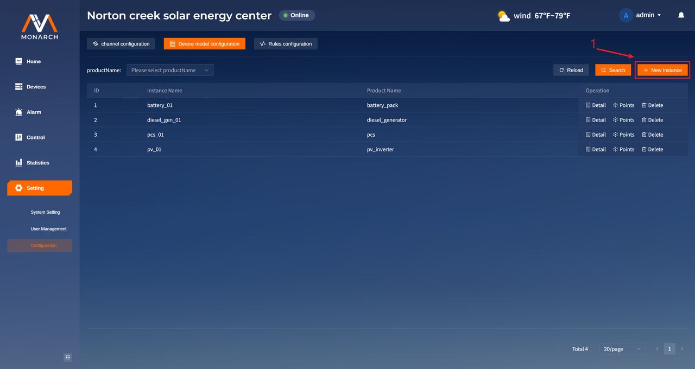
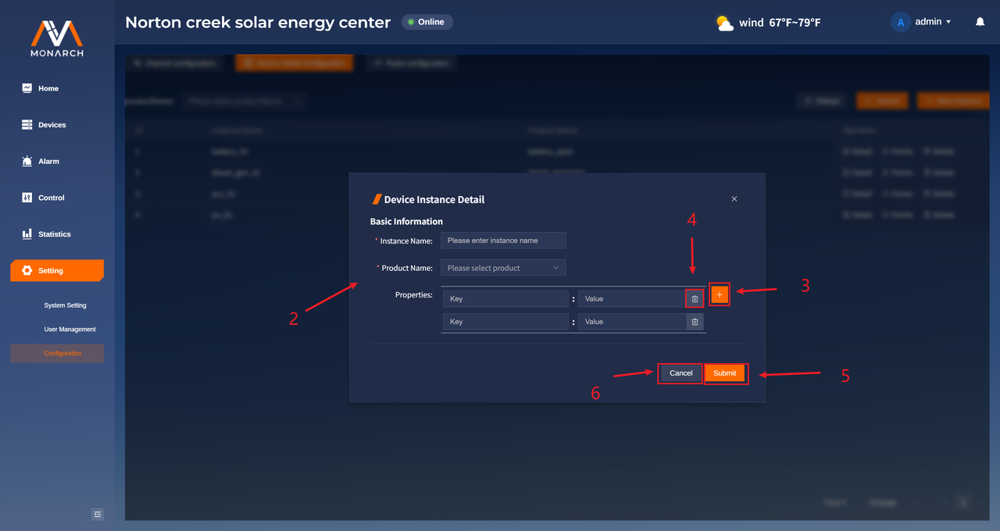
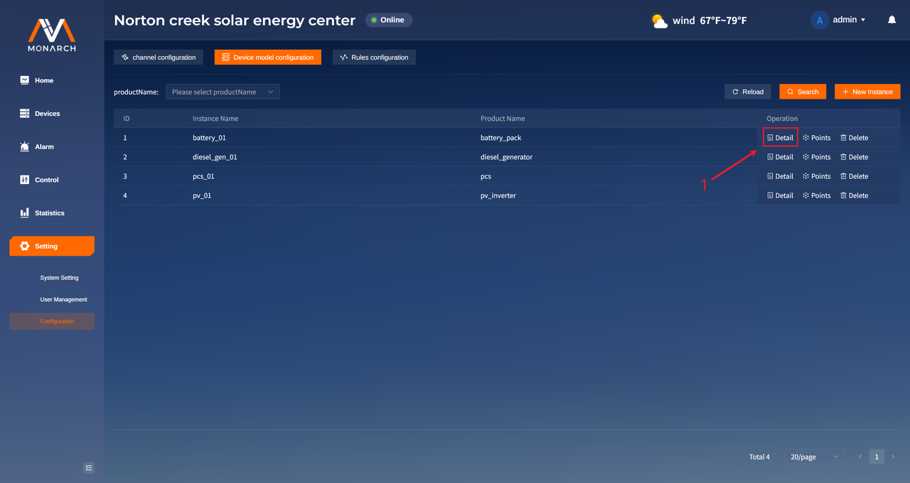
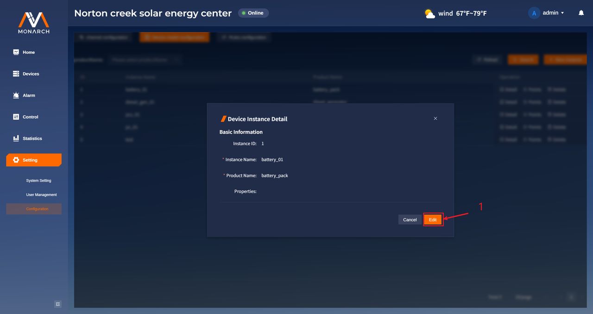
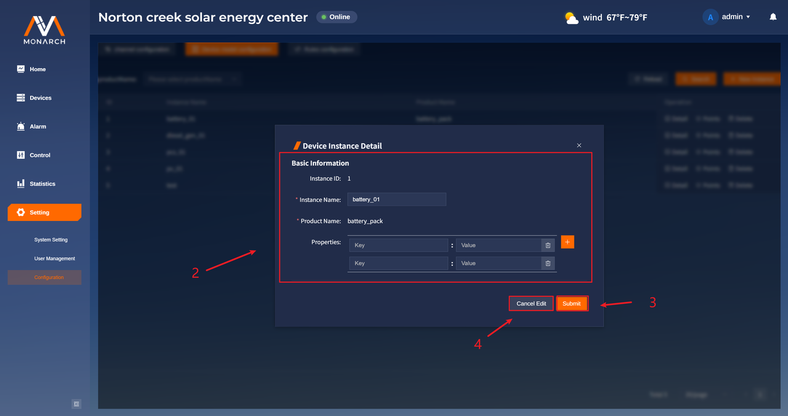
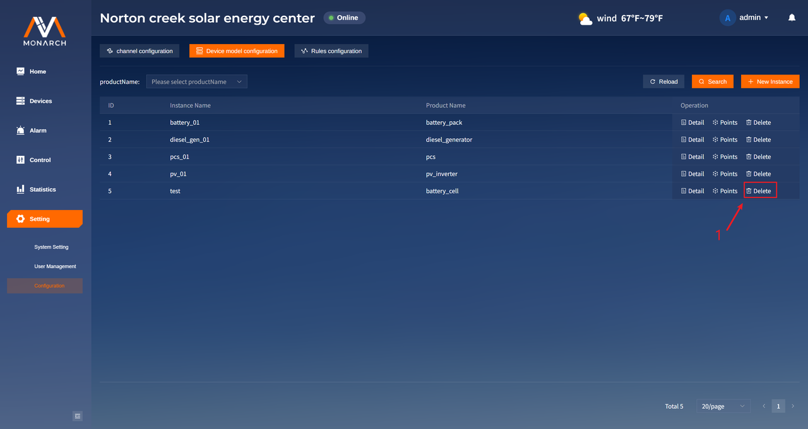
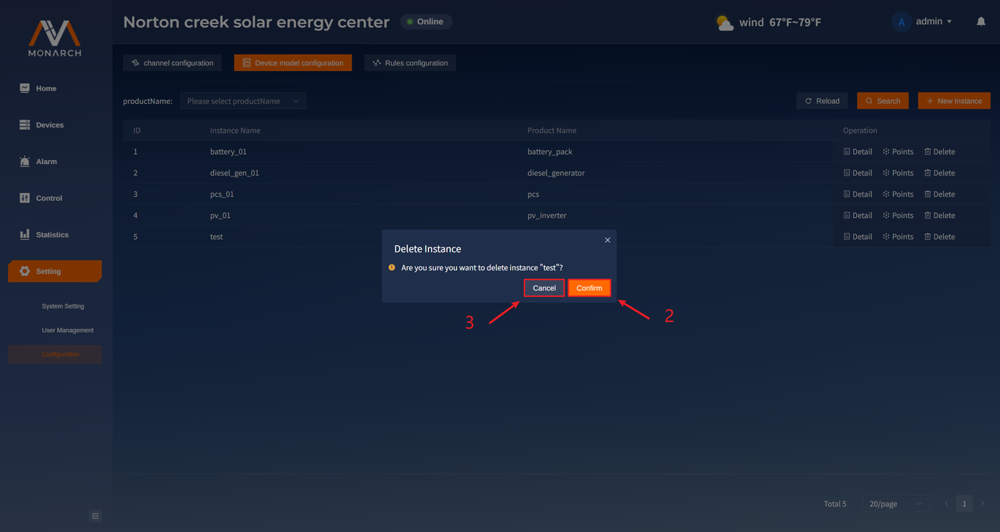

# 实例管理

## 查询设备实例

1. 支持对实例进行筛选。筛选条件有：
- `Product_Name`：实例所属的产品名称。
2. 点击**Search**按钮，进行筛选搜索。
3. 点击**Reload**按钮，进行搜索重置。

## 新增设备实例

1. 点击New Instance按钮，打开新增实例弹框。

2. 填入正确的参数，字段详情参考基础概念实例的字段介绍。
3. 点击属性添加图标按钮，可以添加一条属性值。
4. 点击属性删除图标按钮，可以删除对应的属性值。
5. 点击Submit按钮，提交新增的实例。
6. 点击Cancel按钮，取消新增。

## 查看设备实例详情

1. 点击所要查看的实例Operation列中的Detail按钮，打开实例详情弹框。

## 编辑设备实例

1. 在查看实例详情的弹框中，点击**Edit**按钮进入实例信息的编辑模式。

2. 在修改中，除去`Product Name`无法进行修改，其余修改与新增中一致。
3. 点击**Submit**按钮进行修改提交。
4. 点击**Cancel Edit**按钮取消编辑。

## 删除已有的设备实例

1. 点击想要删除的设备实例行中**Operation**列的**Delete**按钮进行删除。

2. 点击**Confirm**按钮确认删除。
3. 点击Cancel按钮取消删除。
