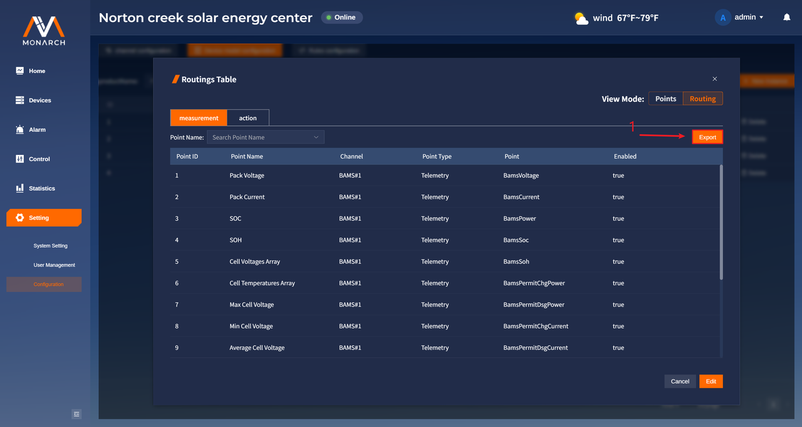
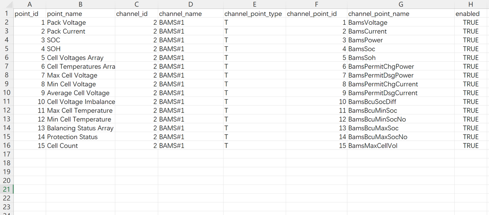
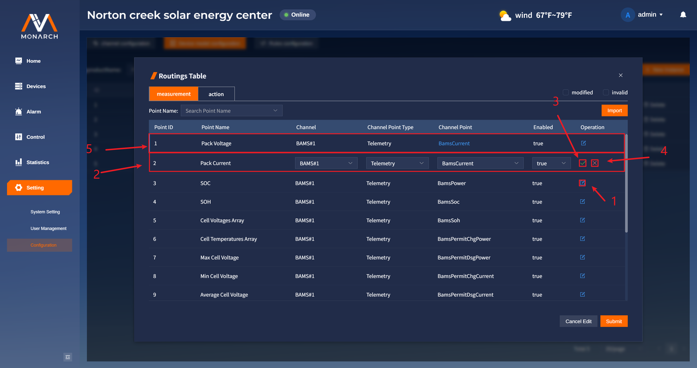
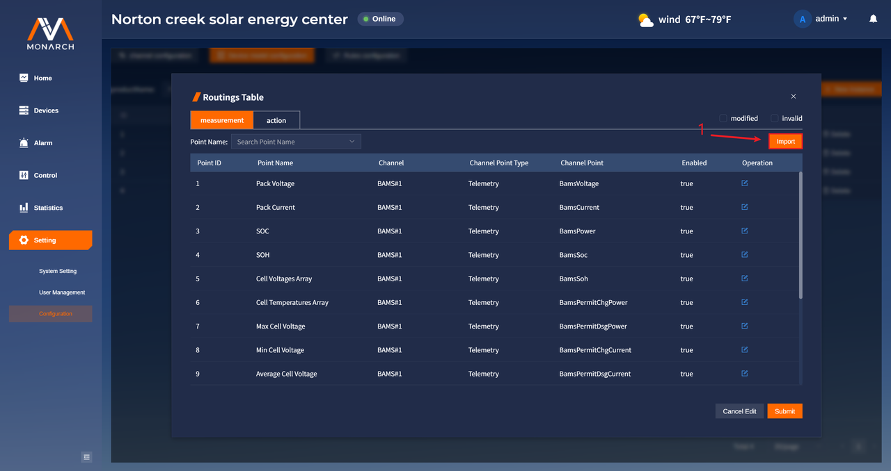
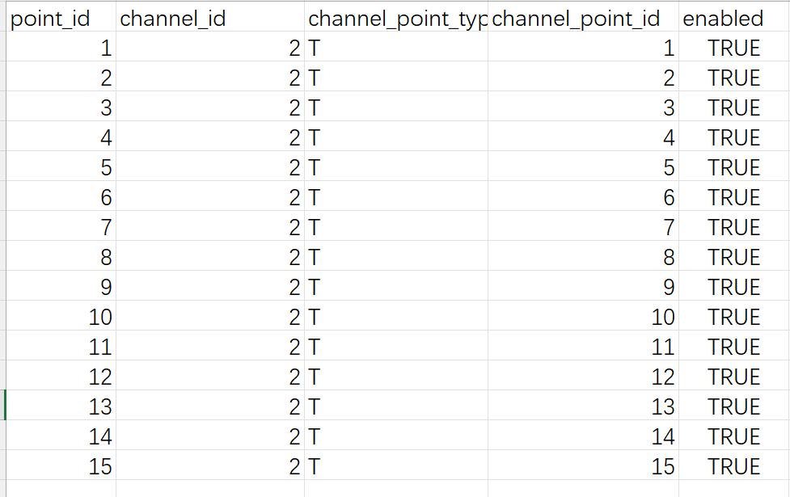

# 实例点位路由配置

1. 通过点击**view Mode**中的**Routing**进行视图切换，打开实例点位路由视图。

2. **Edit**按钮，点击以进入点位路由的修改模式。

  > 注意：property点位是产品的固有属性，不需要通过路由与通道点位相通，因此在点位路由中只有measurement类型和action类型。

## 导出点位路由CSV文件

2. 点击**Export**按钮，将当前显示的表格数据进行导出，导出的csv文件的文件名格式为：**实例名称_点位类型（measurement/action）_routing_当前时间戳.csv**，文件如下图所示：
    
    在导出文件中，**point_type**以缩写的形式展示，其对应规则为：**T对应Telemetry，S对应Signal，C对应Control，A对应Adjustment。**

## 批量修改实例点位路由

1. 点击**Edit**按钮，进入点位路由的编辑模式。

2. 针对修改过程中的修改操作，可以通过筛选条件进行筛选：

- **modified**：对进行了实际修改的点位进行筛选，修改后的点位记录左侧显示为蓝色，修改后的数据标为蓝色。

- **invalid**：对通过增加、修改后存在问题的点位进行筛选，存在问题的点位记录的左侧显示为橙色，背景显示为暗红色。

> 点位路由配置规则：
>
> * Channel为设备实例点位路由映射的通道点位所在的通道。
> * Channel Point Type为设备实例点位路由映射的通道点位所属的四遥类型，按照通道所遵循协议的不同，其可选值也不同：
>   * 对于遵循modbus_rtu和modbus_tcp协议的通道。其中对于measurement类型的设备实例点位，Channel Point Type只能是Telemetry和Signal，对于action类型的设备实例点位，Channel Point Type只能是Control和Adjustment。
>   * 对于遵循di_do协议的通道。其中对于measurement类型的设备实例点位，Channel Point Type只能是Signal，对于action类型的设备实例点位，Channel Point Type只能是Control。
> * Channel Point为设备实例点位路由映射的通道点位。
> * 三个选项的具有先后顺序，需按照Channel->Channel Point Type->Channel Point的顺序进行选择。 

### 手动修改点位路由信息

1. 点击所要修改的点位路由的**修改图标**按钮对点位进行修改。
2. 依照点位路由的配置规则，对点位路由进行修改，对已有点位进行修改的时候，不可以修改id。
3. 点击**确认图标**按钮，本地保存对点位路由的修改。
4. 点击**取消图标**按钮，取消本次本地对点位路由的修改。
5. 本地修改后的点位路由记录样式如图所示，其会把修改的数据使用蓝色进行标记。可以通过“**modified**”筛选条件进行筛选。

### 通过文件导入点位路由信息

1. 点击**Import**按钮，选择**.csv格式**的点位文件进行导入，对文件的内容有以下要求：

- 期望表头**(必须包含以下表头信息，其他额外表头也可以存在，但是并不会起作用)**：
  `point_id,channel_id,channel_point_type,channel_point_id,enabled`
  在导入后，会根据**point_id**进行点位与路由信息的匹配。
  
- 字段说明：
  - `point_id`为实例点位的id，如果点位不存在，则这条点位路由信息无效。
  - `point_name`为实例点位的名称。
  - `channel_id` 为路由映射的通道点位所属通道的id，如果该通道并不存在，则对应的通道点位也视为不存在，会进行错误提示。
  - `channel_point_type`为路由映射的通道点位所属的点位类型（四遥：T/S/C/A），**其接受四遥的缩写：T、S、C、A，也接受四遥的全称：Telemetry、Signal、Control、Adjustment（注意要严格遵循字母的大小写要求）**。
  - `channel_point_id`为路由映射的通道点位id，如果该点位不存在，则会进行错误提示。
  - `enabled`为该点位映射是否可用的标识，接受**false**和**true**两个值。
  
- 格式截图：

  

> 注意：
>
> * 通过文件导入的形式进行实例点位路由修改的时候，其会整体覆盖当前的点位路由信息。
>
> * 导入时会根据点位id来进行逐一匹配。如果文件中点位id在页面中的点位中并不存在，则会进行忽略；如果文件中有重复的点位路由信息，那么会使用较后面的点位路由信息。

### 提交所有的修改

1. 在提交时必须保证修改的点位数据没有问题，错误提示会出现在错误数据下方。
2. 点击**Submit**按钮进行批量修改提交。
3. 点击**Cancel Edit**按钮，退出修改，点位表展示初始值。
    注意：无需手动进行查询，直接点击**Submit**按钮之后，若有问题可以直接进行跳转。
