# 规则链路操作

## 查看规则链路详情及实时执行链路


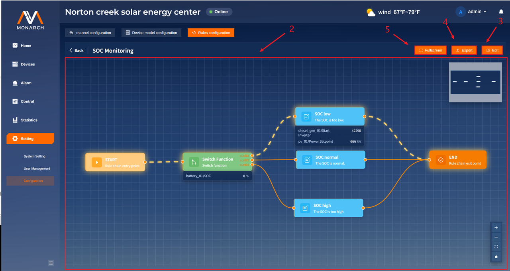

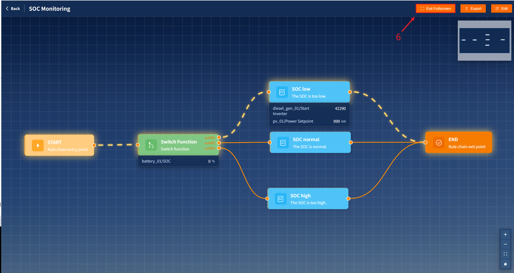

1. 点击所要查看规则行的**Operation**列的**Detail**按钮，挑战到规则链详情页面。

2. 规则链路中高亮的路径为当前规则所执行的路径，当前所执行的路径的节点的具体数据会显示节点的下方位置。

3. 点击**Edit**按钮，进入规则链编辑状态。

4. 点击**Export**按钮对当前规则链进行导出，导出文件的格式为**.json文件**，具体内容结构如下：

  ```
  {
    "cooldown_ms": 5000, //循环间隔
    "description": "Control the diesel generators and photovoltaic systems based on the values of SOC.",//规则链描述
    "enabled": true,//是否可用
    "flow_json": {//用于记录点位以及线段的信息
   "edges": [//所有线段的信息
     {
       "id": "edge-1766625864321",//线段id
       "source": "start",//线段起点节点
       "target": "node-1766625792260",//线段结束节点
       "sourceHandle": "right",//线段起点节点的输出点位id
       "targetHandle": "left"//线段终点节点的接受点位id
     },
     {
       "id": "edge-1766627137707",
       "source": "node-1766625792260",
       "target": "node-1766627111063",
       "sourceHandle": "out001",
       "targetHandle": "left"
     },
     {
       "id": "edge-1766627164179",
       "source": "node-1766627111063",
       "target": "end",
       "sourceHandle": "right1",
       "targetHandle": "left"
     },
     {
       "id": "edge-1766627167317",
       "source": "node-1766627120005",
       "target": "end",
       "sourceHandle": "right1",
       "targetHandle": "left"
     },
     {
       "id": "edge-1766627188300",
       "source": "node-1766627123081",
       "target": "end",
       "sourceHandle": "right1",
       "targetHandle": "left"
     },
     {
       "id": "edge-1766970657249",
       "source": "node-1766625792260",
       "target": "node-1766627120005",
       "sourceHandle": "out002",
       "targetHandle": "left"
     },
     {
       "id": "edge-1766970658549",
       "source": "node-1766625792260",
       "target": "node-1766627123081",
       "sourceHandle": "out003",
       "targetHandle": "left"
     }
   ],
   "nodes": [//所有节点的信息
     {
       "id": "start",//节点的id
       "type": "start",//起始节点
       "position": {//画布中的位置
         "x": -213,//x轴坐标
         "y": 107//y轴坐标
       },
       "data": {//内部数据
         "config": {//点位配置
           "wires": {//输出点位以及其对应的节点id（除特殊类型点位以外其余默认为default点位）
             "default": [
               "node-1766625792260"
             ]
           }
         },
         "description": "START",//节点描述信息
         "id": "start",//节点id
         "label": "START",//节点的标题
         "status": "",//节点状态，保留
         "type": "start"//节点类型
       }
     },
     {
       "id": "end",
       "type": "end",//结束点位
       "position": {
         "x": 629,
         "y": 101
       },
       "data": {
         "config": {
           "wires": {
             "default": []
           }
         },
         "description": "END",
         "id": "end",
         "label": "END",
         "status": "",
         "type": "end"
       }
     },
     {
       "id": "node-1766625792260",
       "type": "custom",//自定义的节点类型
       "position": {
         "x": 25,
         "y": 106
       },
       "data": {
         "cardId": "function-2",
         "config": {//该节点为function-switch类型的节点，主要用来条件判断
           "rule": [//记录输出点位以及具体规则判断
             {
               "name": "out001",//输出点位的名称，与wires中的输出点位对应
               "rule": [//具体的规则
                 {
                   "operator": "<=",//操作符
                   "type": "variable",//记录的类型参数，此时只有一条规则
                   "value": 5,//数值
                   "variables": "X1"//比较的值的名称，与variables中所给予的名称相同
                 }
               ],
               "type": "default"//保留字段
             },
             {
               "name": "out002",
               "type": "default",
               "rule": [
                 {
                   "type": "variable",
                   "variables": "X1",
                   "operator": ">=",
                   "value": 49
                 },
                 {
                   "type": "relation",//记录的类型参数，为relation说明这是一个连接符号，以此处理多个判断规则
                   "value": "And"//连接的符号为And
                 },
                 {
                   "type": "variable",
                   "variables": "X1",
                   "value": 99,
                   "operator": "<"
                 }
               ]
             },
             {
               "name": "out003",
               "type": "default",
               "rule": [
                 {
                   "type": "variable",
                   "variables": "X1",
                   "operator": ">",
                   "value": 99
                 }
               ]
             }
           ],
           "variables": [//所需要参数定义
             {
               "instance_id": 1,//点位所属实例的id
               "instance_name": "battery_01",//点位所属实例的名称
               "name": "X1",//默认给予名称，用于在节点规则中配置，规则为"X+num"
               "pointType": "measurement",//点位的类型
               "point_name": "SOC",//点位的名称
               "type": "single",//参数定义的类型，分为single和combined
               "unit": "%",//点位的单位
               "point_id": 3,//点位的id
               "formula": []//当参数定义类型为combined的时候，记录组合类参数定义的形式
             }
           ],
           "wires": {//对于“function-switch”功能卡片，其会有多个接口，此处记录了每个输出节点所对应的下一个点位的id。
             "out001": [
               "node-1766627111063"
             ],
             "out002": [
               "node-1766627120005"
             ],
             "out003": [
               "node-1766627123081"
             ]
           }
         },
         "description": "Switch function",
         "id": "node-1766625792260",
         "label": "Switch Function",
         "type": "function-switch",
         "status": ""
       }
     },
     {
       "id": "node-1766627111063",
       "type": "custom",
       "position": {
         "x": 300,
         "y": -5
       },
       "data": {
         "cardId": "action-1",
         "config": {
           "rule": [//规则配置
             {
               "Variables": "X1",//定义的参数值
               "value": 42290//赋予的值（如果是数字则是具体的数值，如果是字符串，则赋予对应参数的值）
             },
             {
               "Variables": "X2",
               "value": 999
             }
           ],
           "variables": [
             {
               "formula": [],
               "instance_id": 2,
               "instance_name": "diesel_gen_01",
               "name": "X1",
               "pointType": "action",
               "point_id": 1,
               "point_name": "Start Inverter",
               "type": "single",
               "unit": ""
             },
             {
               "name": "X2",
               "type": "single",
               "instance_id": 4,
               "instance_name": "pv_01",
               "pointType": "action",
               "point_id": 5,
               "point_name": "Power Setpoint",
               "unit": "kW",
               "formula": []
             }
           ],
           "wires": {
             "default": [
               "end"
             ]
           }
         },
         "description": "The SOC is too low.",
         "id": "node-1766627111063",
         "label": "SOC low",
         "type": "action-changeValue",//该类型的节点可以用来执行某些action或者修改点位的值。
         "status": ""
       }
     },
     {
       "id": "node-1766627120005",
       "type": "custom",
       "position": {
         "x": 302,
         "y": 101
       },
       "data": {
         "cardId": "action-1",
         "config": {
           "rule": [
             {
               "Variables": "X1",
               "value": 42289
             },
             {
               "Variables": "X2",
               "value": 999
             }
           ],
           "variables": [
             {
               "name": "X1",
               "type": "single",
               "instance_id": 2,
               "instance_name": "diesel_gen_01",
               "pointType": "action",
               "point_id": 1,
               "point_name": "Start Inverter",
               "unit": "",
               "formula": []
             },
             {
               "name": "X2",
               "type": "single",
               "instance_id": 4,
               "instance_name": "pv_01",
               "pointType": "action",
               "point_id": 5,
               "point_name": "Power Setpoint",
               "unit": "kW",
               "formula": []
             }
           ],
           "wires": {
             "default": [
               "end"
             ]
           }
         },
         "description": "The SOC is normal.",
         "id": "node-1766627120005",
         "label": "SOC normal",
         "type": "action-changeValue",
         "status": ""
       }
     },
     {
       "id": "node-1766627123081",
       "type": "custom",
       "position": {
         "x": 297,
         "y": 219
       },
       "data": {
         "cardId": "action-1",
         "config": {
           "rule": [
             {
               "Variables": "X1",
               "value": "X2"
             }
           ],
           "variables": [
             {
               "name": "X1",
               "type": "single",
               "instance_id": 4,
               "instance_name": "pv_01",
               "pointType": "action",
               "point_id": 5,
               "point_name": "Power Setpoint",
               "unit": "kW",
               "formula": []
             },
             {
               "name": "X2",
               "type": "single",
               "instance_id": 3,
               "instance_name": "pcs_01",
               "pointType": "measurement",
               "point_id": 2,
               "point_name": "DC Power",
               "unit": "kW",
               "formula": []
             }
           ],
           "wires": {
             "default": [
               "end"
             ]
           }
         },
         "description": "The SOC is too high.",
         "id": "node-1766627123081",
         "label": "SOC high",
         "type": "action-changeValue",
         "status": ""
       }
     }
   ]
    },
    "format": "vue-flow",
    "id": "1",//规则id
    "name": "SOC Monitoring",//规则名称
    "priority": 10//优先级
  }
  ```

5. 点击**FullScreen**按钮，进入全屏模式。

6. 点击**Exit Fullscreen**按钮，退出全屏模式。

## 修改规则链路

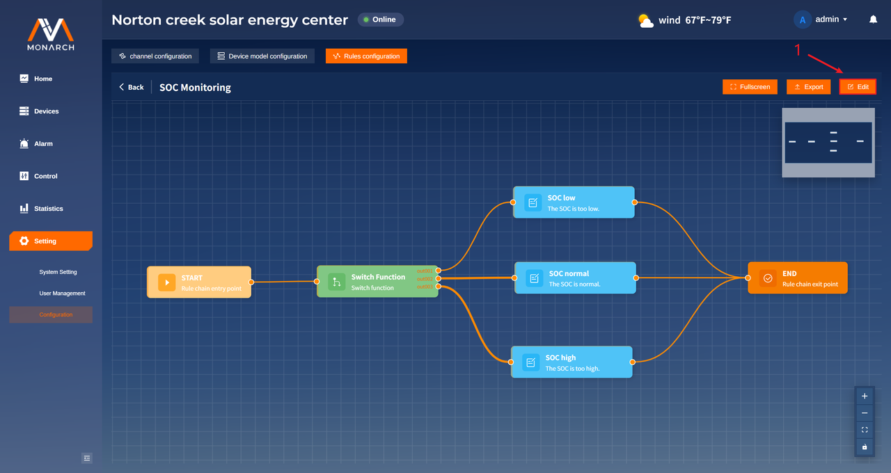

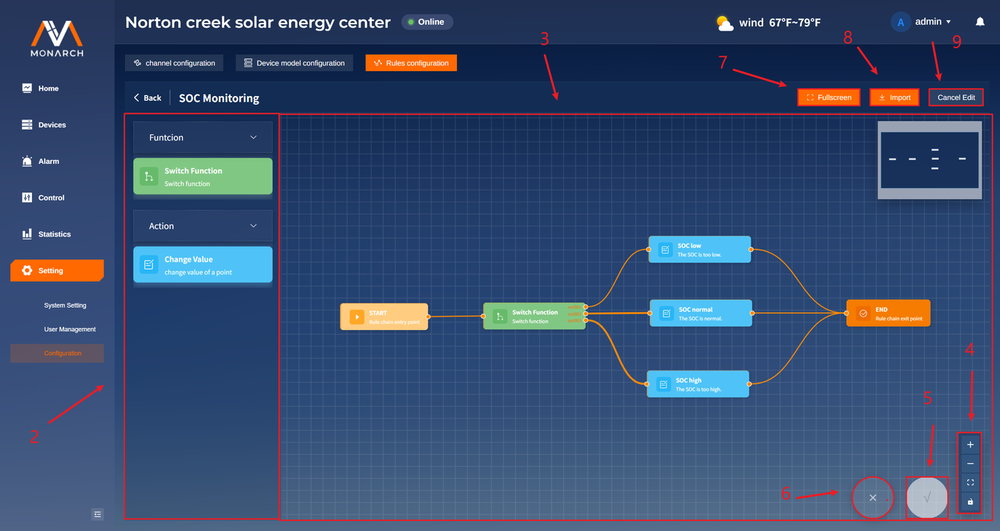

1. 点击**Edit**按钮进行到规则链的编辑模式。

2. 此处为自定义的功能卡片，可以使用鼠标点击所需要的卡片进行拖拽，从而放置到规则链的画布中。不同的卡片具有不同的功能：

     - **Switch Function——数值判断卡片**
       
       该卡片主要用于对实例的点位数据的值是否满足某一条件进行判断。
     - **Change Value——数据修改卡片**
       
       该卡片主要用来修改某一实例的点位数据。

3. 此处为规则链的画布，可以在此处进行卡片的配置、连线。基础操作如下：

     - 画布中必须要有**Start**卡片和**End**卡片的存在，**规则链必须从Start卡片开始，以End卡片结束**。
     - 卡片的左侧的点位为输入点位，只能作为连线的终点；卡片的右侧的点位为输出点位，只能作为连线的起点。
     - 需要进行删除操作的时候，单击卡片或者线段，再点击键盘中的”Backspace“键进行删除**（start卡片和end卡片是不能够删除的）**。
     - 双击卡片进行卡片内部的参数配置，不同的卡片类型所编辑的数据不同：
       - **Switch Function——数值判断卡片**
         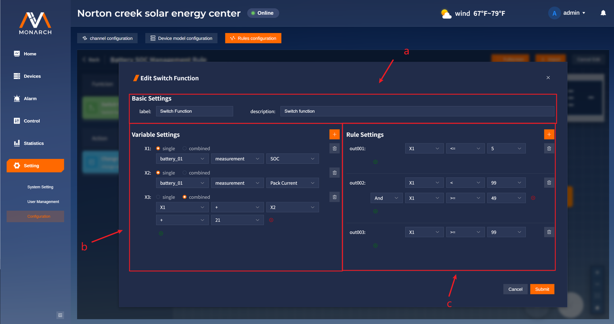
       
         1. 第一部分为基础信息区域，主要是卡片展示的信息：**label**为卡片的标题信息，**description**为卡片的描述信息。
         2. 第二部分为参数定义区域，在此处进行参数的声明：
             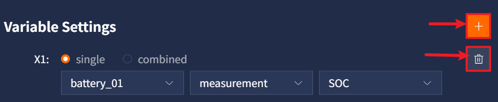
             点击添加按钮，可以进行参数定义的新增，每个参数给予的名称为**X+自增序列号**。
             点击每个参数对应的删除图标按钮，可以删除该的参数。
             参数声明有两种类型：**single**和**combined**类型，其规则如下：

           * **single**类型为单一参数定义。用户只需要依次选择实例名称、点位类型、点位名称即可。
             
       
           * **combined**类型为组合式参数定义。用户可以选择已经定义的参数或者手动输入数字进行组合式计算，支持选择运算符：`+、-、*、/`。用户点击下方的**绿色新增图标**按钮可以增加一行数据运算参数，点击对应运算数据右侧的**红色删除图标**按钮，可以删除这一行数据。
             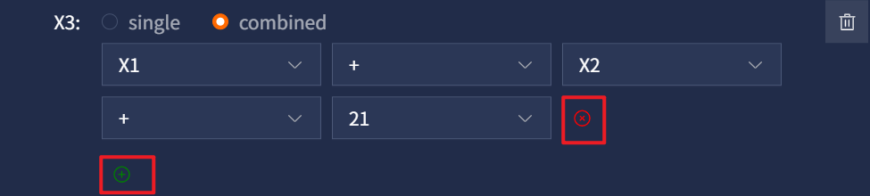
         3. 第三部分判断规则定义区域，在此处进行规则的声明：
             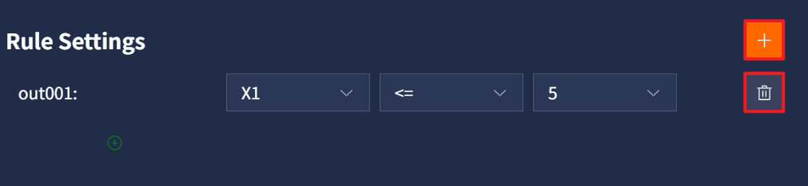
             点击**橙色新增图标**按钮新增规则，每次新增的规则的给予的名称为**out+自增列号**。
             点击每个规则对应的**删除图标**按钮删除该规则。
             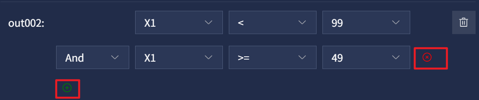
             根据在参数定义中的参数名称，用户在此处可以选择已经定义的参数与其他参数或者数值进行比较。用户可以点击绿色新增按钮，添加额外一行规则判断，并进行组合式判断（目前两个判断之间只允许And判断，及两者都满足)，用户可以点击对应规则后面的红色删除按钮，对这一行规则判断进行删除。

           > 注意：每一个完整的**out+xxx**的规则都会在节点卡片上生成一个对应的点位，只有满足判断条件的时候，才会执行这个点位连通的下一节点。
           > 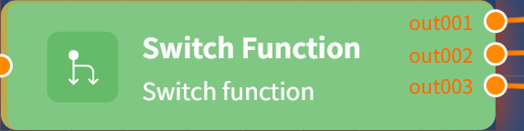
       - **Change Value——数据修改卡片**
         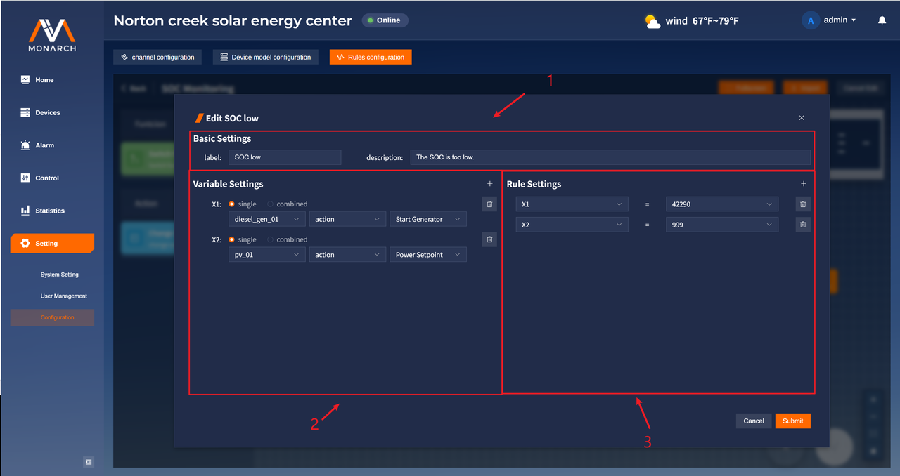
         
         1. 第一部分为基础信息区域，主要是卡片展示的信息：**label**为卡片的标题信息，**description**为卡片的描述信息。
         2. 第二部分为参数定义区域，在此处进行参数的声明，其声明方式同**Switch Function**中的声明方式。
         3. 第三部分为修改规则定义区域，在此处进行实例点位参数的修改。
             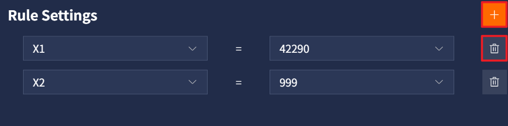
             点击**橙色新增图标**按钮，新增参数修改规则。
             点击每个修改规则对应的**删除图标**按钮，删除该规则。
             对于参数的设置分为左右两个参数。整体逻辑是要把左侧的参数修改为右侧的数值或者参数。左侧的选择框只能选择**single**类型的参数；右侧的选择框可以选择任意已经定义的参数或者自定义数值。
4. 画布控件，从上到下依次为：放大画布按钮、缩小画布按钮、规则链自适应画布大小按钮、禁止/允许画布操作按钮。
5. 规则链保存按钮。当进行点位/线段的增加、修改、删除操作时才允许进行保存。
6. 规则链取消按钮。当进行点位/线段的增加、修改、删除操作时才允许进行取消，其会将规则链恢复到未保存之前的样子。
7. **Fullscreen**按钮，点击打开全屏编辑状态。
8. **Import**按钮，点击后可以选择.json文件进行规则链的导入操作，**对.json文件的格式要求同导出的.json文件格式**。
9. **Cancel Edit**按钮，点击后退出编辑状态。
